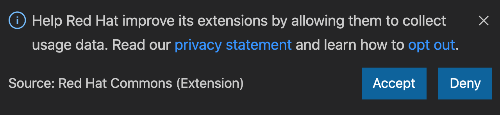

# Red Hat Commons
Red Hat Commons provides services common to extensions published by Red Hat.

## Telemetry reporting
With your approval, extensions published by Red Hat collect anonymous usage data and send it to Red Hat servers to help improve our products and services. Read our [privacy statement](https://developers.redhat.com/article/tool-data-collection) to learn more about it.

The first time one of Red Hat extension engaging in telemetry collection runs, you will be asked to opt-in Red Hat's telemetry collection program:

Whether you accept or deny the request, this pop up will not show again.

## How to disable telemetry reporting?
If you want to stop sending usage data to Red Hat, you can set the `redhat.telemetry.enabled` user setting to `false`.

From File > Preferences > Settings (On macOS: Code > Preferences > Settings), search for telemetry, and uncheck the `Redhat > Telemetry : Enabled` setting. This will silence all telemetry events from Red Hat extensions going forward.

## CI Builds
CI builds can be installed manually by following these instructions:

  1) Download the latest development VSIX archive [from here](https://download.jboss.org/jbosstools/snapshots/vscode-commons//?C=M;O=D). `(vscode-commons-XXX.vsix)`

  2) Go to the Extensions section in VSCode.

  3) At the top right click the `...` icon.

  4) Select 'Install from VSIX...' and choose the visx file.
